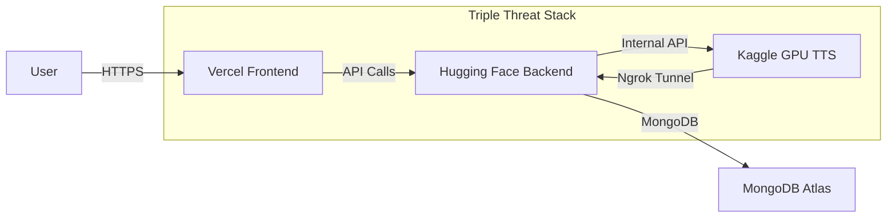

# Triple Threat Deployment Plan - Elite Developer Strategy

## Overview
This plan outlines the deployment strategy using the Triple Threat stack:
1. **Vercel (Frontend)** - Fast loading dashboard
2. **Hugging Face (Backend)** - 24/7 stable API with 16GB RAM using Docker
3. **Kaggle (AI Engine)** - Free GPU power for TTS tasks

---

## Current Project Analysis

### Existing Files Reviewed
- `backend/server.js` - Express API server (251 lines)
- `Dockerfile` - Node.js 18-alpine based
- `backend/package.json` - Dependencies including express, mongoose, bcryptjs, jwt
- `frontend/app.js` - Frontend JavaScript with API calls to `http://localhost:3001/api`

### Key Observations
1. **Port Configuration**: Currently uses PORT 3001, needs to change to 7860 for Hugging Face
2. **CORS**: Currently configured for `process.env.FRONTEND_URL || 'http://localhost:3000'`
3. **API_URL**: Frontend uses `http://localhost:3001/api` - needs production URL update

---

## Required Modifications

### 1. Hugging Face Backend Setup

#### A. New Dockerfile (HF-optimized)
Create a separate `Dockerfile.huggingface` for Hugging Face Spaces:

```dockerfile
FROM node:20

WORKDIR /app

COPY package*.json ./
RUN npm install

COPY . .

EXPOSE 7860

CMD ["node", "backend/server.js"]
```

#### B. Backend Server.js Changes
- Change PORT from `3001` to `7860`
- Change `app.listen(PORT, () =>` to `app.listen(PORT, '0.0.0.0', () =>`

#### C. Backend package.json Changes
- Update start script: `"start": "node backend/server.js"`
- Ensure all dependencies are listed

### 2. Environment Variables Configuration

Required secrets for Hugging Face Spaces:

| Variable | Description | Example |
|----------|-------------|---------|
| `MONGO_URI` | MongoDB Atlas connection string | `mongodb+srv://...` |
| `JWT_SECRET` | JWT signing secret | Random secure string |
| `INTERNAL_SECRET` | Bridge secret for Kaggle communication | `SELLSHOUT_INTERNAL_SECRET_99` |
| `KAGGLE_URL` | Ngrok URL from Kaggle GPU | `https://abc123.ngrok-free.dev/generate-internal` |
| `FRONTEND_URL` | Vercel frontend URL | `https://your-project.vercel.app` |
| `NODE_ENV` | Environment | `production` |
| `PORT` | Server port (7860) | `7860` |

### 3. CORS Configuration Update

Update `server.js` to allow Vercel frontend:

```javascript
app.use(cors({
  origin: [
    process.env.FRONTEND_URL,
    'https://your-frontend.vercel.app'
  ],
  credentials: true,
  methods: ['GET', 'POST', 'PUT', 'DELETE'],
  allowedHeaders: ['Content-Type', 'Authorization']
}));
```

### 4. Frontend API URL Changes

Update `frontend/app.js` line 14:
```javascript
// Change from:
const API_URL = window.API_BASE_URL || window.VITE_API_URL || 'http://localhost:3001/api';

// To:
const API_URL = window.API_BASE_URL || window.VITE_API_URL || 'https://your-space-name.hf.space/api';
```

### 5. Vercel Configuration

The existing `frontend/vercel.json` should work, but ensure the frontend knows the production API URL. Consider setting `API_BASE_URL` as a Vercel environment variable.

---

## Deployment Steps

### Step 1: Prepare Backend for Hugging Face
- [ ] Create `Dockerfile.huggingface`
- [ ] Update `backend/server.js` port to 7860 and bind to 0.0.0.0
- [ ] Update `backend/package.json` start script path

### Step 2: Deploy Backend to Hugging Face
- [ ] Create new Space on Hugging Face (Docker, Blank template)
- [ ] Push code to Hugging Face repository
- [ ] Set environment variables in Space settings
- [ ] Verify health endpoint: `https://your-space.hf.space/api/health`

### Step 3: Deploy Frontend to Vercel
- [ ] Connect GitHub repo to Vercel
- [ ] Set `API_BASE_URL` environment variable to Hugging Face URL
- [ ] Deploy and verify

### Step 4: Configure Kaggle Connection
- [ ] Run Kaggle TTS notebook with Ngrok
- [ ] Update `KAGGLE_URL` in Hugging Face secrets with new Ngrok URL
- [ ] Test TTS endpoint through the full stack

---

## Security Considerations

1. **JWT Authentication**: Keep `JWT_SECRET` secure in Hugging Face secrets
2. **Internal Secret**: The `INTERNAL_SECRET` protects the Kaggle-Hugging Face bridge
3. **CORS**: Only allow requests from your specific Vercel domain
4. **Rate Limiting**: The existing `rateLimiter` middleware should remain

---

## Architecture Diagram



---

## Testing Checklist

- [ ] Backend health check returns `{ status: 'ok' }`
- [ ] User registration works through Vercel → HF
- [ ] User login works and returns JWT token
- [ ] TTS generation works end-to-end
- [ ] CORS properly blocks unauthorized origins
- [ ] Rate limiting prevents abuse

---

## Rollback Plan

If issues arise:
1. Keep local development running at `localhost:3001`
2. Use Git branches for deployment testing
3. Hugging Face allows easy version rollback through their UI